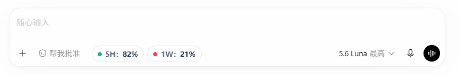

# codex-quota

Read the English documentation [here](README.en.md).

Codex 额度查询工具 / Read-only Codex quota monitor for Windows。

这是一个只读 Windows 额度查询工具，只显示当前已登录 Codex 账号返回的 5H 和 1W（周）额度，并以无边框小窗口贴近 Codex Desktop 底部。

## UI 样式



- **绿色**：剩余额度大于 60%
- **黄色**：剩余额度为 30%–60%
- **红色**：剩余额度低于 30%

如果账号没有 5H 限制，5H 胶囊会隐藏，1W 胶囊自动移动到原 5H 位置。

## 运行前提

- Windows 11 x64 或 Windows 10 x64。
- 运行最终安装包前无需预先安装 Microsoft .NET 10 Desktop Runtime；安装包检测不到时会使用包内的官方安装程序完成安装。
- 如果需要生成安装包，`build-codex-quota.exe` 需要本机安装 .NET SDK；当本机没有 Runtime 缓存时，首次打包还需要联网下载官方 .NET 10 Desktop Runtime，之后会复用缓存并将其嵌入最终安装包，用户安装时无需再次下载。

## 安全边界

- 仅在活动且可见的 ChatGPT Desktop 窗口、Codex 运行时和已登录账号同时存在时显示并读取；窗口关闭、最小化、切换应用或认证不可用时停止读取并隐藏，恢复后重试。
- 仅调用 `initialize`、`account/read`（`refreshToken: false`）和 `account/rateLimits/read`，并只接收 `account/rateLimits/updated` 通知。
- 保持只读：不登录、登出、切换账号、重置额度、创建对话或发送任务；不读取、复制或写入 Token、Cookie、`auth.json`。
- App Server 仅通过本地 `stdio` 子进程运行，不修改 Codex 安装目录。

## 刷新策略

- 启动且确认已登录后读取一次。
- 收到额度更新通知后立即重新读取一次。
- 仅在 Codex 仍打开时，默认每 120 秒进行一次兜底检查；间隔由 `config/settings.json` 中的 `fallbackRefreshSeconds` 控制。

## 程序文件说明

安装目录：

```text
codex-quota.exe             安装后启动入口，启动 runtime/codex-quota.exe
codex-quota-launcher.exe    启动监听器，绑定 Codex 启动任务
uninstall-codex-quota.exe   卸载任务、注册信息和安装目录
runtime\codex-quota.exe     实际运行的 Companion
```

源码/打包目录：

```text
build-codex-quota.exe       询问安装包生成位置，再执行构建
codex-quota-setup.exe       build-codex-quota.exe 生成的最终安装包
```
